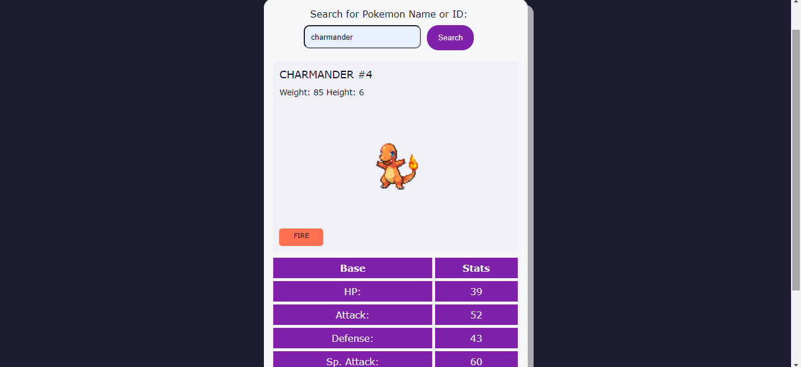

# Pokemon Search App 🚀

## Project Description 📝

The Pokemon Search App is a web application that allows users to search for and view detailed information about various Pokemon. Built with HTML, CSS, and JavaScript, this app fetches data from a Pokemon API to provide users with up-to-date information on their favorite Pokemon.

## Demo 📸




## Technologies Used 🛠️


- HTML
- CSS
- JavaScript

## Installation 💻


Folow these steps to set up the project on your local machine 
Ensure you have the following software installed on your machine

```bash
#git clone
```
```bash
#gitgit@github.com:Saqibi4213/Pokemon-search-App.git
```

## Usage 🎯


you can access to my project through git clone 
-git clone the HTTP or My SSH code link from the repository you what to clone 

```bash
#git clone
```

## Features ⭐

- Search Functionality: Users can search for Pokemon by name or ID.
- Dynamic Display: The app dynamically displays information such as Pokemon images, types, abilities, and stats.   
- Responsive Design: The app is fully responsive, ensuring a seamless experience on both desktop and mobile devices.

## Author 👩‍💻
- Website: [website.com]( https://saqibi4213.github.io/Pokemon-search-App/)
- LinkedIn: [Mehria saqibi](https://www.linkedin.com/in/mehria-saqibi-a386a41a1?utm_source=share&utm_campaign=share_via&utm_content=profile&utm_medium=android_app)
- Email: [email](mosawermh@gmail.com)

## Contributing 🤝

Contributions are welcome! If you'd like to contribute, please fork the repository and create a pull request. Ensure that your code follows the project's coding standards and guidelines.


